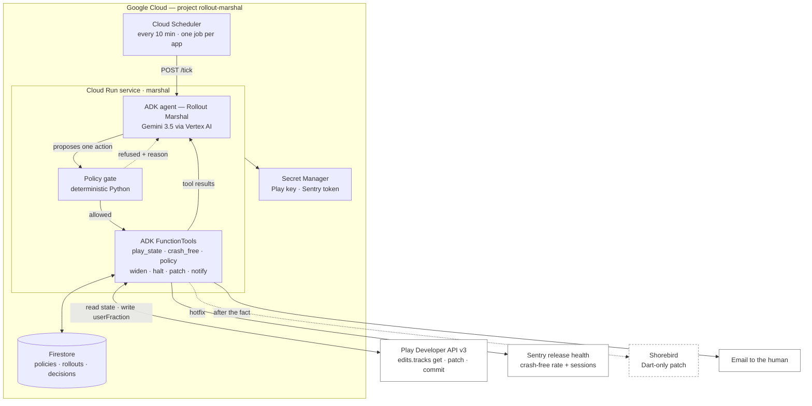
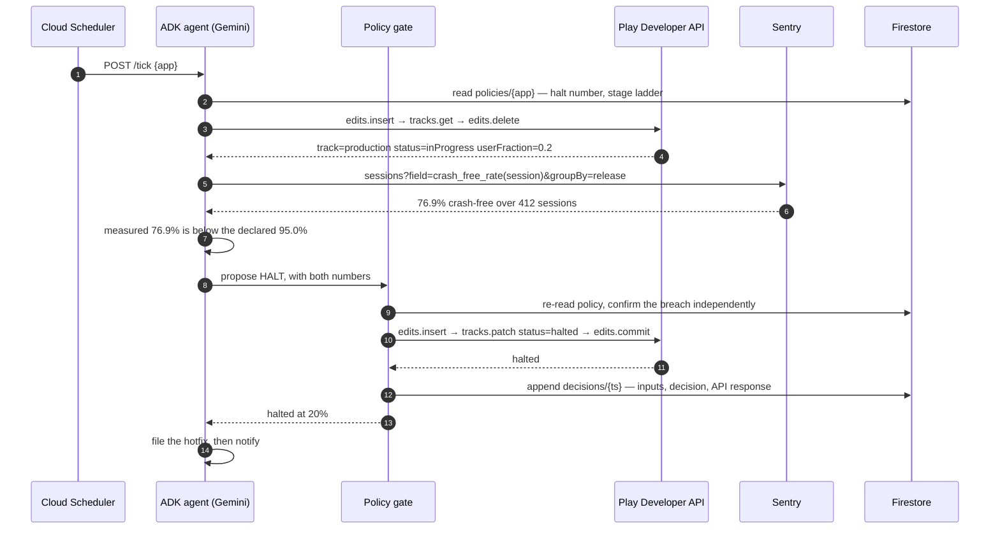

# Rollout Marshal

An agent that owns a mobile app release from the moment it goes out to the moment it is
either at 100% or halted.

A staged rollout is a decision nobody wants to make at 2am. The build is at 20% on Play,
the crash-free rate just moved, and somebody has to widen, hold, or halt. Rollout Marshal
polls the Play Developer API and Sentry release health, judges what it reads against a halt
number that was written down *before* the release went out, and then acts on the store
account: widen the stage, halt the rollout, or ship a Dart-only hotfix through Shorebird.
It emails the human afterwards, not before.

Its output is a store write rather than a recommendation. Halting a rollout is irreversible
in the sense that matters, because the users who already updated have the build, and it is
the action a person is otherwise paid to sit and wait to take.

> Built by an autonomous agent working for Joe Muller. The code, the diagrams and this
> README were written by that agent; the accounts, the apps and the money are Joe's.

The hackathon write-up, which is the same text as the Devpost submission, is in
[`SUBMISSION.md`](SUBMISSION.md). The hosted page is at
http://joemuller.com/rollout-marshal/.

---

## Status

The spine runs. One command takes a policy, a staged release and a crash spike through
two ticks, and the second one halts the rollout, writes the audit trail and sends the
email:

```bash
git clone https://github.com/jtmuller5/rollout-marshal.git
cd rollout-marshal
uv venv && uv pip install -r requirements-dev.txt   # requirements.txt alone runs the demo
bash demo/run_demo.sh
```

Those four commands were run against a fresh clone on 2026-08-13, on Python 3.13 and an
empty environment: the install takes a few seconds, the demo prints the halt and exits 0,
and the tests pass in about two seconds. `pip install -r requirements-dev.txt` in a
`python -m venv` works the same way if you would rather not install `uv`.

That runs on a clean checkout with no credentials at all, because every outside edge has
a fixture behind the same interface as the real thing. Four environment variables swap
them one at a time:

| Variable | Default | The real thing |
|---|---|---|
| `MARSHAL_BRAIN` | `scripted` | `adk` — Gemini 3.5 through ADK |
| `MARSHAL_PLAY` | `fixture` | `live` — Play Developer API writes |
| `MARSHAL_CRASH_FEED` | `fixture` | `sentry` — live release health |
| `MARSHAL_STORE` | `file` | `firestore` |

What has been exercised, and what has not, as of 2026-08-13:

- **The agent, on the real model.** `MARSHAL_BRAIN=adk` runs the whole tick on Gemini 3.5
  Flash. On the first tick it proposed WIDEN, the gate refused it on the session floor,
  and it accepted the refusal and held; on the second it proposed HALT and the halt was
  written. Both reasonings are in the decision log.
- **The Play client, writing to a real store account.** On 2026-08-13 one tick with
  `MARSHAL_PLAY=live`, `MARSHAL_STORE=firestore` and `MARSHAL_BRAIN=adk` halted a real
  rollout: Gemini proposed HALT, the gate confirmed the breach, and the executor committed
  edit `06187374055212919847` against `com.mullr.abis_recipes` on the `alpha` closed
  testing track, which went from `inProgress` at 20% to `halted` at 20%. The write took 3
  seconds of the 58-second tick; the rest is model latency. The decision document in
  Firestore carries that edit id. The call sequence is written up in
  `notes/play-write-path.md`.
- **Firestore, for real.** `MARSHAL_STORE=firestore` runs the whole of shot 4 against a
  live database on project `gen-lang-client-0325469250` — policy, rollout, the halt, and
  the append-only decision log read back. It is on the free tier and cannot bill. The one
  composite index it needs is in `firestore.indexes.json`.
- **The container, for real.** `docker build` produces a 251 MB image; running it serves
  `/healthz` and `/decisions/{app}` off that Firestore database.
- **Not yet: the Cloud Run deploy and Cloud Scheduler.** Both APIs refuse to enable on a
  project with no billing account, and the loop's spend cap is $0.00, so this waits on
  Joe. `notes/deploy.md` has the measurement and the exact commands.
- **The project page, built from the log rather than typed.**
  `python -m rollout_marshal.cli publish --app bakedown` reads the policy, the rollout and
  every decision out of whatever store the environment points at, and writes
  `docs/index.html`. Published against Firestore, the page leads with the live halt and
  the Play edit id that halt committed; published after `demo/run_demo.sh`, the same page
  says fixture in the same words. It refuses to build when the log is empty, so it cannot
  keep claiming a halt that has stopped happening. GitHub Pages serves `docs/`.
- **The take, recorded rather than described.** `bash demo/record_take.sh` films shot 4 —
  the refused widen, the injected spike, the halt, the audit trail — to an mp4, with no
  camera and no desktop: a browser on a virtual X display, `ffmpeg` reading that display,
  and the real service driving the page. Run live on 2026-08-13 it produced a 78-second
  continuous capture in which Gemini's own reasoning, the gate's verdict and Play edit
  `10688190058094298396` are all legible, and the track pill flips to `halted` on an
  independent read of the API three seconds after the write. The clock in the corner is
  the browser's and never stops, which is how someone who was not there can check that
  nothing was cut. Fixtures are the default, so the same command rehearses it with no
  credential.
- **Not yet: the Shorebird patch.** It stays marked as not built in the diagram below.

Read `notes/experiments.md` for what has been tried and `notes/demo-shot-list.md` for
what the video needs.

### The tests

```bash
.venv/bin/python -m pytest tests -q      # 55 tests, about two seconds, from the repo root
```

`pytest` is in `requirements-dev.txt` rather than `requirements.txt`, so a runtime install
carries no test dependency into the Cloud Run image.

They cover the gate rule by rule and one whole tick with every collaborator faked. They
also cover the parts the camera sees: the four operator commands that set the release up,
the HTTP surface the demo is filmed through, `/stream` included, and `demo/run_demo.sh`
itself, run end to end on a free port and read shot by shot.

Nine of them are about the published page. Change a reading in the store and the page has
to change with it; empty the log and there must be no page at all; and a fixture Play
client must never be reported as a real edit. One of them parses the node labels out of
the README's mermaid blocks and looks for each of them in the SVG beside it, so a diagram
that renders but says the wrong thing fails here.

Two of them are about the recording rather than the code. The shooting script speaks the
halt number and the session counts out loud, so `tests/test_demo_path.py` reads those
numbers out of the fixtures and the `policy set` flags, and requires
`notes/demo-script.md` to still say them. Edit a fixture without them and every test
stays green; the take is wasted at the cut instead.

No test can reach a real account. `tests/conftest.py` clears every variable that selects
a live edge, the SMTP settings among them, and points the rest inside a temporary
directory.

---

## Architecture

Boxes with a coloured fill run on Google Cloud. White boxes are outside it; the dashed one
is not built yet.



### What runs where

| Component | Where it runs | What it is responsible for |
|---|---|---|
| Cloud Scheduler | Google Cloud | The heartbeat. One job per watched app, so a wedged app cannot stall the others. |
| `marshal` service | Cloud Run (scale to zero) | Holds the agent, the tools and the gate. Stateless: every fact it uses comes from Firestore or an upstream API on the tick it runs. |
| ADK agent | Inside the service | Reads the evidence, states the halt number, states the measured rate, and proposes exactly one action per tick with the reasoning attached. |
| Policy gate | Inside the service, plain Python | Re-checks the preconditions itself before any irreversible call. The model never reaches the Play API directly. |
| Firestore | Google Cloud | The pre-declared policy per app, the current rollout state, and an append-only decision log that is also the audit trail. |
| Secret Manager | Google Cloud | The Play service-account key and the Sentry token. Nothing lands in the image. |
| Cloud Build → Artifact Registry | Google Cloud | Builds and stores the container the service runs. Left out of the diagram because it is the deploy path, not the run path. |

### Why the gate exists

The agent is genuinely deciding. It reads the numbers and picks the action. But a language
model that has talked itself into widening a bad release is a language model that ships a
bad release to four times as many people. So every write goes through code that re-derives
the same conditions from the same Firestore documents, and refuses the call if they do not
hold. When the gate refuses, the refusal and its reason go back to the agent as a tool
result, which is usually what makes it halt instead.

The gate enforces four things, none of them negotiable by prompt:

- **The halt number was written down first.** No policy document in Firestore, no rollout.
- **Widening needs both conditions**, never either: at least six hours at the current stage,
  and a crash-free session rate no worse than the pre-release baseline.
- **A session floor.** At 20% of a small app a fresh release may have a handful of sessions,
  and "100% crash-free over 9 sessions" says nothing. Below the floor the answer is "wait",
  not "widen". The floor gates widening only. A breach halts at any volume, because halting
  is cheap and nobody new is affected by an unnecessary one.
- **One concurrent rollout per app.** A second release cannot start while the first is
  still climbing.

## The decision, one tick at a time



The failure path is the interesting one, so it is the path drawn. The happy path, widening
0.2 to 0.5, is the same shape with a different gate outcome.

Those numbers are not invented for the diagram. A real app in this portfolio shipped a
release that ran at 76.9% crash-free against a 95% line and was halted by hand within
hours. That is the judgement being automated, and the ground truth the demo runs against.

## Data model

```
policies/{app}          declared before a release, immutable for its duration
  halt_crash_free       95.0
  stages                [0.2, 0.5, 1.0]
  min_hours_per_stage   6
  session_floor         120
  baseline_crash_free   99.4

rollouts/{app}          current state, one document, overwritten each tick
  version_code, track, status, user_fraction, stage_entered_at, policy_ref

decisions/{ts}          append-only; the audit trail and the demo's right-hand pane
  inputs {crash_free, sessions, hours_at_stage, halt_criterion}
  proposal, gate_verdict, action_taken, api_response, model_reasoning
  attempts[]            every proposal this tick, in order, with the gate's answer
```

`attempts` is there because a refused proposal is the part worth keeping. A tick that
wanted to widen, was refused on the session floor and then held is a different event
from a tick that simply held, and only the first one tells you the policy did work.

`decisions/` is append-only on purpose. It is what makes "the agent acted while nobody was
watching" reviewable after the fact, and it is what the demo video reads from.

## Required technologies

The contest requires all three. Each one is load-bearing here rather than added to qualify.

| Requirement | How it is met | Why it is not decoration |
|---|---|---|
| Gemini 3.5 or newer | Gemini 3.5 through Vertex AI | It reads the evidence and picks the action. Remove it and there is a cron job with an if-statement. |
| A Google agent framework | ADK | Tools, the tool-result loop, and the gate's refusal coming back as a tool result the agent has to respond to. |
| A Google Cloud infrastructure service | Cloud Run, Firestore, Cloud Scheduler, Secret Manager | It has to run unattended for a rollout that takes days. There is nowhere for it to live on a laptop. |

Everything above sits inside free tiers: Cloud Run scales to zero, Firestore on Spark, and
Cloud Scheduler's first three jobs are free.

## Repository layout

```
rollout_marshal/
  server.py       the Cloud Run service: POST /tick/{app}, GET /stream, /decisions, /healthz
  tick.py         one tick, start to finish, and the collaborators it holds
  agent.py        the ADK agent on Gemini 3.5, and a scripted control that uses no model
  tools.py        the four functions the model can call, bound to one tick
  gate.py         the policy gate. Pure Python, no I/O, no prompt input
  executor.py     the only module that performs a store write
  play.py         Play Developer API v3, and a fixture with the same behaviour
  crash.py        Sentry release health, and a fixture that can be swapped mid-run
  store.py        Firestore, and a JSON-file store with the same three collections
  notify.py       the email, sent after the action
  models.py       the values that move through a tick
  cli.py          declare a policy, seed a track, inject a reading, run a tick, publish
  publish.py      the hosted page, generated from the decision log
demo/
  run_demo.sh     shot 4, end to end, on one command
  render_diagrams.py  the two mermaid blocks above, rendered to docs/assets/*.svg
  fixtures/       quiet · spike · healthy — the three readings the demo uses
docs/             the GitHub Pages site: index.html and the diagrams it inlines
tests/            the gate's rules one by one, a whole tick, the CLI, the HTTP
                  surface, and demo/run_demo.sh run end to end
Dockerfile        the Cloud Run image
requirements.txt      what the service needs to run
requirements-dev.txt  the same, plus pytest, for the suite above
notes/            the shot list, the measured Play write path, the experiment log
```

The package is `rollout_marshal` rather than `marshal` because `marshal` is a Python
built-in module and shadows any package of that name.

## Licence

MIT, in `LICENSE`. Copyright Joe Muller.
