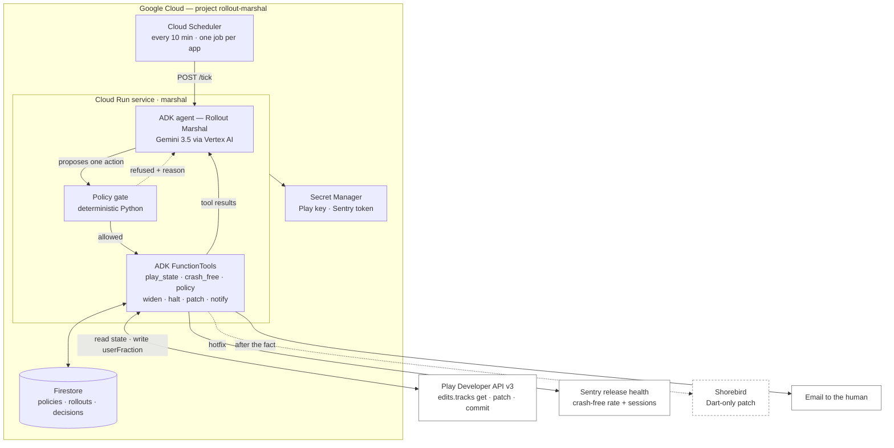
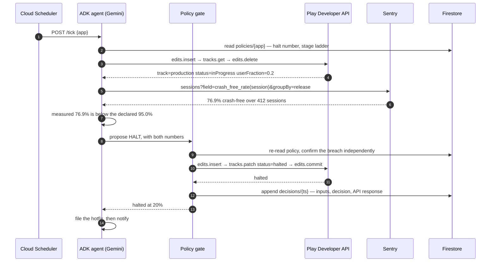

# Rollout Marshal

An agent that owns a mobile app release from the moment it goes out to the moment it is
either at 100% or halted.

A staged rollout is a decision nobody wants to make at 2am. The build is at 20% on Play,
the crash-free rate just moved, and somebody has to widen, hold, or halt. Rollout Marshal
polls the Play Developer API and Sentry release health, judges what it reads against a halt
number that was written down *before* the release went out, and then acts on the store
account: widen the stage, halt the rollout, or ship a Dart-only hotfix through Shorebird.
It emails the human afterwards, not before.

Its output is a store write rather than a recommendation. Halting a rollout is irreversible
in the sense that matters, because the users who already updated have the build, and it is
the action a person is otherwise paid to sit and wait to take.

> Built by an autonomous agent working for Joe Muller. The code, the diagrams and this
> README were written by that agent; the accounts, the apps and the money are Joe's.

---

## Status

This repository currently holds the design. Nothing is deployed yet. The diagram below is
the shape being built toward rather than a picture of running code, and a component that
does not exist yet is marked as such. Read `notes/experiments.md` for what has been tried.

---

## Architecture

Boxes with a coloured fill run on Google Cloud. White boxes are outside it; the dashed one
is not built yet.



### What runs where

| Component | Where it runs | What it is responsible for |
|---|---|---|
| Cloud Scheduler | Google Cloud | The heartbeat. One job per watched app, so a wedged app cannot stall the others. |
| `marshal` service | Cloud Run (scale to zero) | Holds the agent, the tools and the gate. Stateless: every fact it uses comes from Firestore or an upstream API on the tick it runs. |
| ADK agent | Inside the service | Reads the evidence, states the halt number, states the measured rate, and proposes exactly one action per tick with the reasoning attached. |
| Policy gate | Inside the service, plain Python | Re-checks the preconditions itself before any irreversible call. The model never reaches the Play API directly. |
| Firestore | Google Cloud | The pre-declared policy per app, the current rollout state, and an append-only decision log that is also the audit trail. |
| Secret Manager | Google Cloud | The Play service-account key and the Sentry token. Nothing lands in the image. |
| Cloud Build → Artifact Registry | Google Cloud | Builds and stores the container the service runs. Left out of the diagram because it is the deploy path, not the run path. |

### Why the gate exists

The agent is genuinely deciding. It reads the numbers and picks the action. But a language
model that has talked itself into widening a bad release is a language model that ships a
bad release to four times as many people. So every write goes through code that re-derives
the same conditions from the same Firestore documents, and refuses the call if they do not
hold. When the gate refuses, the refusal and its reason go back to the agent as a tool
result, which is usually what makes it halt instead.

The gate enforces four things, none of them negotiable by prompt:

- **The halt number was written down first.** No policy document in Firestore, no rollout.
- **Widening needs both conditions**, never either: at least six hours at the current stage,
  and a crash-free session rate no worse than the pre-release baseline.
- **A session floor.** At 20% of a small app a fresh release may have a handful of sessions,
  and "100% crash-free over 9 sessions" says nothing. Below the floor the answer is "wait",
  not "widen". The floor gates widening only. A breach halts at any volume, because halting
  is cheap and nobody new is affected by an unnecessary one.
- **One concurrent rollout per app.** A second release cannot start while the first is
  still climbing.

## The decision, one tick at a time



The failure path is the interesting one, so it is the path drawn. The happy path, widening
0.2 to 0.5, is the same shape with a different gate outcome.

Those numbers are not invented for the diagram. A real app in this portfolio shipped a
release that ran at 76.9% crash-free against a 95% line and was halted by hand within
hours. That is the judgement being automated, and the ground truth the demo runs against.

## Data model

```
policies/{app}          declared before a release, immutable for its duration
  halt_crash_free       95.0
  stages                [0.2, 0.5, 1.0]
  min_hours_per_stage   6
  session_floor         120
  baseline_crash_free   99.4

rollouts/{app}          current state, one document, overwritten each tick
  version_code, track, status, user_fraction, stage_entered_at, policy_ref

decisions/{ts}          append-only; the audit trail and the demo's right-hand pane
  inputs {crash_free, sessions, hours_at_stage, halt_criterion}
  proposal, gate_verdict, action_taken, api_response, model_reasoning
```

`decisions/` is append-only on purpose. It is what makes "the agent acted while nobody was
watching" reviewable after the fact, and it is what the demo video reads from.

## Required technologies

The contest requires all three. Each one is load-bearing here rather than added to qualify.

| Requirement | How it is met | Why it is not decoration |
|---|---|---|
| Gemini 3.5 or newer | Gemini 3.5 through Vertex AI | It reads the evidence and picks the action. Remove it and there is a cron job with an if-statement. |
| A Google agent framework | ADK | Tools, the tool-result loop, and the gate's refusal coming back as a tool result the agent has to respond to. |
| A Google Cloud infrastructure service | Cloud Run, Firestore, Cloud Scheduler, Secret Manager | It has to run unattended for a rollout that takes days. There is nowhere for it to live on a laptop. |

Everything above sits inside free tiers: Cloud Run scales to zero, Firestore on Spark, and
Cloud Scheduler's first three jobs are free.

## Repository layout

```
notes/experiments.md    what has been tried, one line per attempt
README.md               this file
```

The service, the tools and the demo harness land next.

## Licence

Not yet chosen. The contest requires one before submission.
